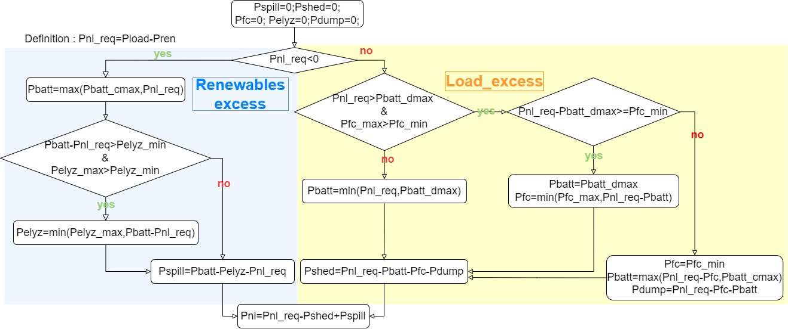
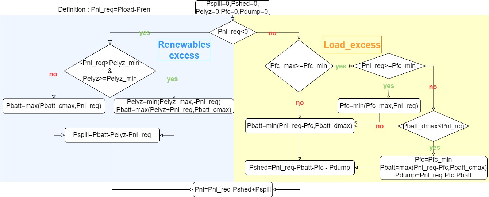

# Operation_strategy_comparison_Microgrid_H2d_With_
This repository summarize the results from the article : .  

**ABSTRACT** – Reaching the 100% REN is a real challenge for islanded microgrids which are usually equipped with diesel 
generators to ensure the reliability of the electricity supply. The introduction of long-term seasonal hydrogen energy storage, 
coupled with short-term battery storage, represents a solution to ensure the quality and reliability of supply, while limiting the 
cost of storage. In this paper, we focus on the sizing problem of these microgrids (with $H_2$), but also on the energy management 
strategy (EMS) to be applied in order to minimize costs and maximize quality of service. We compare the results of 2 different energy
management strategies.  
### Topology of a microgrid with hydrogen long term storage

### Energy Management Strategy compared

#### Strategy 1 : Battery priority
In this strategy, the battery will be primarily use to store the excessive energy , and to provide the energy to the grid when it will be needed . The Electrolyser and the fuel cell, will be use only , if the battery is not suffiscient (in term of power to store or provide) or empty. 

  

#### Strategy 2 : hydrogen priority
This strategy will do the exact opposite of the strategy 1. It will prior the the electrolyser to transform the excessive 

We determined wich strategy is better , and we also made a sensitivity analysis on the price of electrolyser and fuel cell prices.

You can see the details of the study here : [Rules_based-comparison](file:Rules_based-comparison.ipynb).  

The results are compiled here : [Results](file:results.xlsx)  

The main figures generated for the article can be seen here : [figures](file:figures.ipynb)

