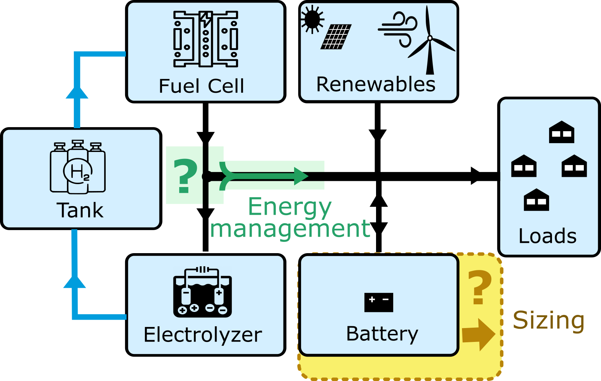

# Operation_strategy_comparison_Microgrid_H2d_With_
This repository summarize the results from the article : . We made a techno-economic comparison between 2 rule based Energy Management Strategies applied to Microgrid with Long-term Hydrogen storage. The aim is to determine wich Energy management strategy is better. WHich one allow the lowest levelized cost of energy , while sarisfying the energy demand .    
### Topology of a microgrid with hydrogen long term storage

### Energy Management Strategy compared

#### Strategy 1 : Battery priority
In this strategy, the battery will be primarily use to store the excessive energy , and to provide the energy to the grid when it will be needed . The Electrolyser and the fuel cell, will be use only , if the battery is not suffiscient (in term of power to store or provide) or empty. 

